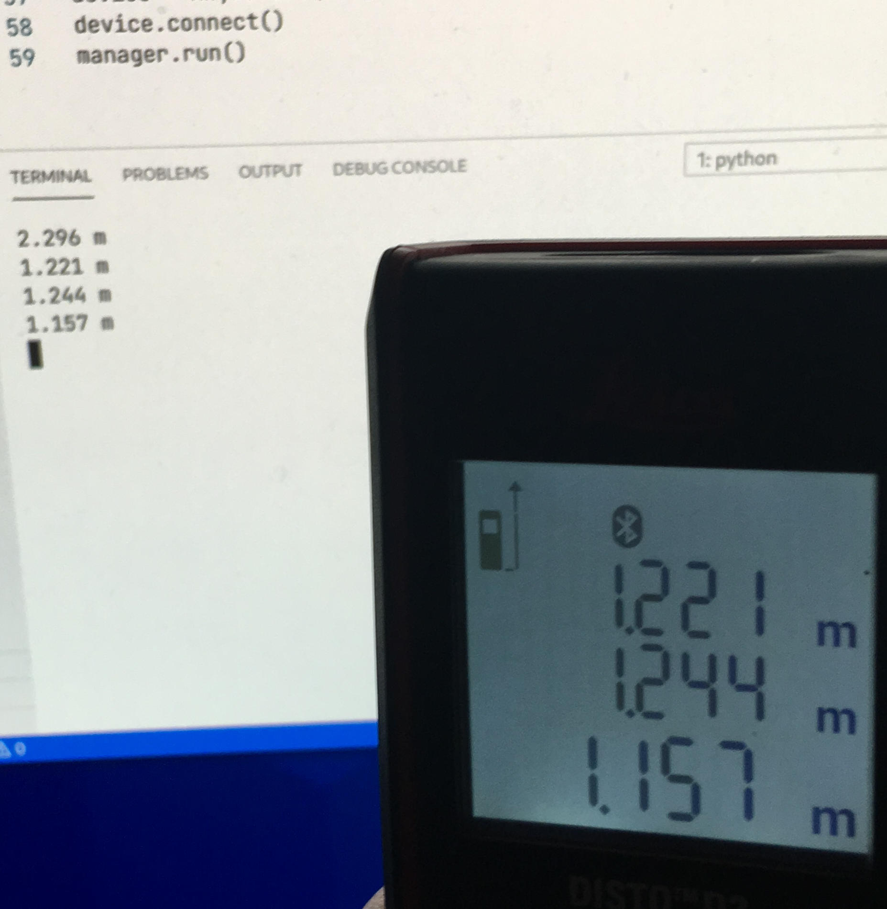

# D2Relay

D2 Relay is a small tool to relay measurements of a Leica Disto D2 Device to the console.

&copy; Copyrights 2021 Hartmut Seichter 

## Screenshot

## Todo

* [ ] Infer correct units
* [ ] Detect error states such as 255 (too close)
* [ ] Make things configurable by using command line parameters 
* [ ] Demonstrator 